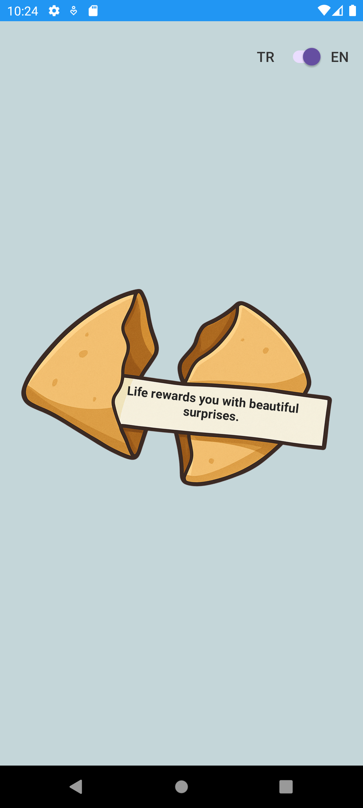

# Fortune Cookie App 🍪

A lightweight Android application developed in Kotlin that delivers random fortune messages to the user. It supports bilingual content (Turkish and English) and includes a smooth, interactive UI with animation states.

## Features
- Interactive Fortune Cookie: Tap to break the cookie and reveal a random fortune; tap again to reset.
- Language Support: Turkish and English toggle using a SwitchCompat, with locale persistence.
- Animation Control: Prevents repeated taps during animation for smooth UX.
- Dynamic Data Loading: Fortunes are loaded from a JSON asset containing paired translations.
- Locale Persistence: User-selected language is saved in shared preferences and applied at runtime.

---
  
## Technologies & Tools

- Kotlin: Modern, statically typed programming language was used.
- JSON Parsing: Double-language data was loaded and parsed from the assets folder using org.json.JSONArray.
- Animation: Rotation and alpha animations were managed with ViewPropertyAnimator.
- Data Classes: Kotlin data classes were used to represent fortune messages in a bilingual format.
- Resource Management: Drawable resources (cookie_closed, cookie_broken) and string resources were effectively utilized.

---

## Screenshots

  
  
  
  

🎥 **Demo Video:** [Watch on YouTube](https://youtu.be/tizJMp6Gq-c)
